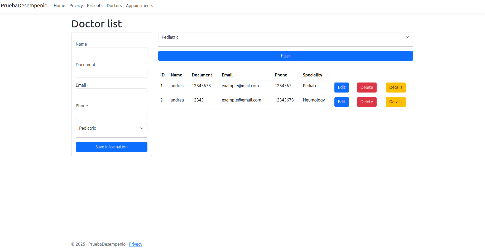

# Hospital San vicente
## Description
This is a solution Proposed by my TL to evaluated my improvement y C# development by testing
all the things I have learned since I'm practicing it.

The solution consist in 3 things, A patients page, a doctors page and an appointments page
all of them count with a totally functional crud with error handler and with their specified
characteristics, also when you create an appointment the patients gets an email about it

## Previous requisites

You will need to have Entity Framework and Pomelo to use MySQL, if you're using Rider, you can just install it through
the nuggets section, if not you can execute
```


dotnet add package Microsoft.EntityFrameworkCore

dotnet add package Pomelo.EntityFrameworkCore.MySql


```

## Executing the project

First you'll need to clone the repository, since I omitted some archives for safety of my data
you can create your own project and copy the archives from the project and paste them in your own

After that you'll need to configure the appsettings.json for the connection string and the email settings with the
next structure you can do it
```
"ConnectionStrings": {
    "DefaultConnection" : "server=localhost;database=hospital_vicente;user=your_user;password=youre_password;"
  },
  "EmailSettings": {
  "SmtpServer": "smtp.gmail.com", // This depends on what type of email youre using
  "SmtpPort": 587,
  "SenderName": "Hospital San Vicente",
  "SenderEmail": "Your email",
  "SenderPassword": "the password for the email or the unique code"
  }
```

After this the project should be ready to execute, just press the button of the arrow on top 
of your editor, or run a dotnet watch to execute it


## Screenshots from the views

### Patients view


### Doctors views




### Appointment view


## Author data

### Name: David Orjuela
### Clan: Hopper
### Email: david123orjuela@gmail.com